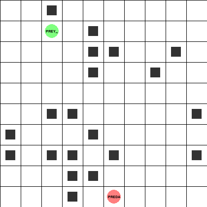

# 🐾 Predator–Prey Gridworld Environment

[](https://github.com/ProValarous/Predator-Prey-Archetype-Gridworld-Environment/actions/workflows/ci.yaml)

A **deterministic, modular, research-grade multi-agent predator–prey environment** built to study coordination, pursuit–evasion, and emergent behavior in Multi-Agent Reinforcement Learning (MARL).

This repository is not just a simulation.

It is a **controlled experimental laboratory** for understanding how multi-agent learning systems behave.

<p align="center">
  
</p>

<p align="center"><em>A speed-2 predator pursuing a speed-1 prey around obstacles (<code>configs/dqn_1v1</code>) until capture.</em></p>

---

## 🎯 What This Repository Is About

This project provides:

* A discrete 2D gridworld with predators and prey
* Explicit, fully inspectable transition dynamics
* Pluggable observation models
* Pluggable reward functions
* Pluggable action spaces (including per-agent speed/stamina mechanics)
* Strict separation between environment and learning
* Deterministic, reproducible experiments

It is designed to make MARL **mechanistically understandable**, not opaque.

---

## ❓ Why This Exists

Most MARL environments:

* Mix environment logic and learning code
* Are difficult to modify safely
* Hide important transition mechanics
* Make reproducibility fragile
* Encourage experimentation by hacking internals

This project exists to enforce something stricter:

```text
Environment dynamics → Perception → Incentives → Learning
```

Each layer is isolated by construction.

* **Environment dynamics** defines what can happen
* **Perception** defines what agents know
* **Incentives** define what agents optimize
* **Learning** defines how they adapt

By separating these layers, we can study each one independently.

That separation is the core idea of this repository.

---

## 🧠 What It Tries to Achieve

This environment aims to:

* Enable controlled MARL experimentation
* Support clean ablation studies
* Enforce reproducibility by design
* Prevent accidental coupling between components
* Provide a safe research codebase for students
* Make emergent behavior inspectable and analyzable

The goal is not realism.

The goal is **clarity, modularity, and scientific control**.

---

## 🏗 Architectural Philosophy

The repository is divided into two major components:

### 1️⃣ `multi_agent_package` — The Environment

Implements:

* Grid environment dynamics, agent movement, capture logic, episode termination (`core/`, immutable)
* Observation plug-ins — perception (`observations/`)
* Reward plug-ins — incentives (`rewards/`)
* Action-space plug-ins — what an agent's action integers mean (`actions/`)
* Wrappers — cross-cutting mechanics layered on top of the base env, e.g. per-agent speed/stamina (`wrappers/`)
* Registries — the only sanctioned way to wire a plug-in into an experiment (`registry/`)

This layer defines the world.

Currently registered plug-ins:

| Category     | Registered options                                                    |
| ------------ | ----------------------------------------------------------------------- |
| Observations | `default`, `local_only`, `local_radius`, `absolute`, `relative`          |
| Rewards      | `base`, `predator_distance`, `survival`                                  |
| Actions      | `discrete_5`, `cross`, `speed_discrete_5`                               |
| Wrappers     | `SpeedWrapper` (per-agent speed/stamina, applied last in the build chain) |

### 2️⃣ `baselines` — The Learning Algorithms

Implements:

* **IQL** — Independent Q-Learning (tabular)
* **CQL** — Centralized Q-Learning (tabular)
* **MixedTrainer** — per-team algorithm assignment (e.g. CQL predators vs IQL prey)
* **DQN** — Deep Q-Network (PyTorch, generic observation encoder, replay buffer)

See [`src/baselines/README.md`](src/baselines/README.md) for the algorithm contract and when to use each one.

Algorithms interact with the environment only through:

```python
env.reset()
env.step(actions)
```

They never access internal state directly.

This guarantees structural integrity.

---

## 🔁 Reproducibility as a First-Class Constraint

An experiment is fully determined by:

* YAML configuration files
* Explicit random seeds
* Registered observation modules
* Registered reward modules

Identical configuration → identical trajectories.

This is enforced, not assumed.

---

## 📂 Repository Structure

```
src/
├── baselines/                # Learning algorithms
│   ├── IQL/  CQL/  MIXED/  DQN/
│   └── registry/              # Algorithm name -> class
└── multi_agent_package/      # Environment
    ├── core/                 # Immutable environment dynamics (maintainers only)
    ├── observations/         # Perception plug-ins
    ├── rewards/              # Incentive plug-ins
    ├── actions/              # Action-space plug-ins
    ├── wrappers/             # Cross-cutting mechanics (e.g. SpeedWrapper)
    ├── registry/             # Safe plug-in selection
    └── scripts/              # Experiment runners (run_from_config, run_dqn, ...)

configs/                      # YAML experiment definitions
├── env.yaml, agents.yaml, observations.yaml, rewards.yaml, actions.yaml
├── experiment_{iql,cql,mixed,dqn}.yaml
└── dqn_1v1/, dqn_speed1/, dqn_speed2/, dqn_speed3/   # ready-made DQN experiment sets

tests/                        # pytest suite: registries, plugin contracts,
                               # end-to-end training, architecture rules
```

Core environment dynamics is stable infrastructure.

Observations, rewards, and actions are the intended extension points.

---

## 🧪 What You Can Study With This

* Emergent cooperation between predators
* Coordination failures
* Reward shaping effects
* Partial observability impact
* Centralized vs decentralized learning
* Constraint-induced coupling (speed, stamina)
* Credit assignment challenges

This environment is meant for:

* MARL research
* Undergraduate research labs
* Algorithm benchmarking
* Teaching reinforcement learning
* Controlled ablation experiments

---

## ⚡ Quickstart

The build backend isn't wired up yet, so `pip install -e .` does **not** make the package importable — use `PYTHONPATH=src` instead. This is the only setup path actually verified to work.

```bash
git clone https://github.com/ProValarous/Predator-Prey-Archetype-Gridworld-Environment.git
cd Predator-Prey-Archetype-Gridworld-Environment

python -m venv .venv
source .venv/bin/activate        # Windows: .venv\Scripts\Activate.ps1

pip install -r requirements.txt

# Run the default experiment (3 predators vs 3 prey, IQL, configs/experiment.yaml)
PYTHONPATH=src python -m multi_agent_package.scripts.run_from_config

# Or one of the ready-made DQN experiments
PYTHONPATH=src python -m multi_agent_package.scripts.run_dqn --config-dir configs/dqn_1v1
```

All experiments are launched from the repository root.

### Running the tests

```bash
pip install -r requirements-dev.txt
PYTHONPATH=src python -m pytest tests/ -q
```

CI (`.github/workflows/ci.yaml`) runs this same suite plus Black/flake8/pylint on every push and PR to `main`/`STRP`, and blocks any PR that touches `core/` (see below).

---

## 👩‍🎓 For Contributors and Students

You are encouraged to:

* Implement new reward functions
* Design new observation schemes
* Design new action spaces or wrappers
* Run structured experiments
* Perform reproducible ablations

You are not expected to modify core environment dynamics — this is enforced automatically: a CI check fails any pull request that touches `src/multi_agent_package/core/`. See [`CONTRIBUTING.md`](CONTRIBUTING.md) for the full contribution rules.

This mirrors how research infrastructure is structured in practice.

---

## 📜 Citation

```bibtex
@misc{predatorpreygridworld,
  author       = {Ahmed Atif and contributors},
  title        = {Predator–Prey Gridworld Environment},
  year         = {2025},
  note         = {A deterministic modular testbed for Multi-Agent Reinforcement Learning}
}
```

---

## 📜 License

Apache License 2.0
