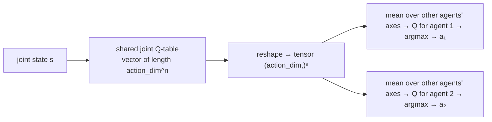
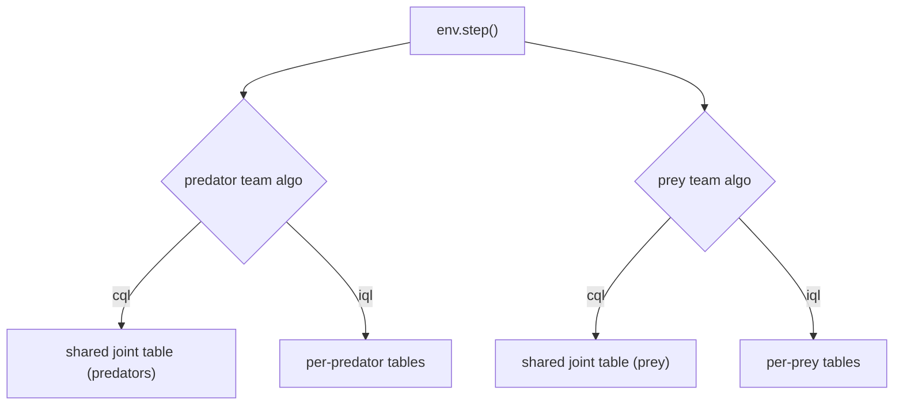

# CQL & MixedTrainer — Centralized and Per-Team Learning

Where [IQL](iql.md) gives every agent its own table, **Centralized Q-Learning
(CQL)** treats a whole team as a single decision-maker with **one shared Q-table
over the joint state and joint action**. **MixedTrainer** then lets you assign IQL
or CQL to each team independently.

## CQL theory

Instead of per-agent $Q_i$, CQL learns a single joint action-value
$Q(\mathbf{s}, \mathbf{a})$ where $\mathbf{s}$ is every agent's observation stacked
together and $\mathbf{a} = (a_1, \dots, a_n)$ is the **joint action**. The learning
signal is the **team's total reward** $r_\text{team} = \sum_i r_i$:

$$
Q(\mathbf{s}, \mathbf{a}) \;\leftarrow\; Q(\mathbf{s}, \mathbf{a}) + \alpha\big[\, r_\text{team} + \gamma \max_{\mathbf{a}'} Q(\mathbf{s}', \mathbf{a}') - Q(\mathbf{s}, \mathbf{a}) \,\big]
$$

Because it optimizes the *joint* value with a shared reward, CQL can represent
coordinated strategies that IQL cannot. The price is size: the joint action space
is the Cartesian product of every agent's actions.

### Acting from a joint table (marginalization)

At execution each agent must choose its *own* action from the joint Q-values. CQL
**marginalizes**: reshape the joint Q-vector to a tensor of shape
$(\text{action\_dim})^{n}$, then for agent $i$ average over every other agent's
axis to get a per-agent Q-vector, and take its `argmax`.



## How CQL works here

**Implementation:** `src/baselines/CQL/cql.py`.

- **One shared table** `self.q_table`: encoded joint state → `np.zeros(action_dim ** n_agents)`.
- **Joint state** `_joint_state()` = tuple of each agent's `_encode_state()`
  (same recursive encoding as IQL).
- **Joint action index** `_joint_action_index()` packs the per-agent actions into
  a single base-`action_dim` integer.
- **Update** — central reward = sum of all agents' rewards; the target uses
  `max` over the whole joint action vector, with the bootstrap cut only on a true
  terminal:

```python
central_r  = sum(float(rewards[aid]) for aid in self.agent_ids)
q_next_max = 0.0 if terminal else float(np.max(self.q_table[joint_s_next]))
td_error   = central_r + self.gamma * q_next_max - self.q_table[joint_s][joint_a]
self.q_table[joint_s][joint_a] += self.alpha * td_error
```

- **Execution** — `select_actions()` reshapes to `(action_dim,) * n_agents` and
  averages over the other axes (`q_tensor.mean(axis=other_axes)`).

> This is a classic joint-action learner, **not** a modern CTDE method (QMIX,
> MADDPG). It trades scalability for an exact, inspectable joint table — see
> [MARL Theory](../concepts/marl.md#centralized-training-decentralized-execution-ctde).

### The cost of centralization

The table stores `action_dim ^ n_agents` values **per joint state**. With 5
actions:

| Agents | Values per joint state |
| --- | --- |
| 2 | 25 |
| 4 | 625 |
| 6 | 15,625 |

Keep grids and agent counts small when using CQL.

## MixedTrainer

`MixedTrainer` (`src/baselines/MIXED/mix_train.py`) assigns an algorithm to each
team separately: predators and prey can each be `iql` or `cql`. CQL teams share one
joint table over that team's joint space; IQL teams keep per-agent tables. Both
update kinds run inside each step.



This is the tool for **asymmetry experiments** — e.g. centralized predators versus
independent prey — which is exactly the comparison the
[research study](../reference/papers.md) built on this environment investigates.

## Configuration

```yaml
# CQL
experiment:
  algorithm:
    name: cql
    params: { alpha: 0.1, gamma: 0.99, epsilon: 1.0, episodes: 5000, seed: 42 }
```

```yaml
# MixedTrainer: centralized predators, independent prey
experiment:
  algorithm:
    name: mixed
    params:
      predator_algo: cql
      prey_algo: iql
      alpha: 0.1
      gamma: 0.99
      episodes: 5000
```

```bash
python -m multi_agent_package.scripts.run_cql
python -m multi_agent_package.scripts.run_mixed
```

## Papers

- Busoniu et al. (2008), *A Comprehensive Survey of Multiagent RL* — joint-action
  learners and the centralized/independent axis.
- Claus & Boutilier (1998), *The Dynamics of RL in Cooperative Multiagent Systems*.
- CTDE successors (context, not implemented here): Lowe et al. (2017, MADDPG),
  Rashid et al. (2018, QMIX), Sunehag et al. (2018, VDN).

Full list: [Papers & Further Reading](../reference/papers.md).
