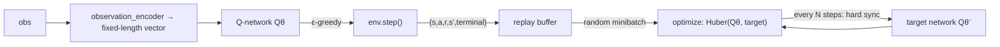

# DQN — Deep Q-Network

**DQN** replaces the Q-*table* with a Q-*network*: a small neural network that maps
an encoded observation to a Q-value per action. This lifts the tabular limit — the
network generalizes across states instead of storing each one — at the cost of the
usual deep-RL machinery (a replay buffer and a target network). Here DQN is
**independent per agent**, mirroring [IQL](iql.md): one network, target network,
and replay buffer each.

For the Double DQN and Dueling DQN improvements, see
[DQN Variants](../concepts/dqn-variants.md).

## Theory

DQN learns parameters $\theta$ so that $Q_\theta(s, a) \approx Q^*(s, a)$ by
minimizing the squared (here Huber) error between the network and a **Bellman
target** computed from a slow-moving copy $\theta^-$ (the *target network*):

$$
y = r + \gamma\,(1 - \text{done})\,\max_{a'} Q_{\theta^-}(s', a'),
\qquad
\mathcal{L}(\theta) = \big(\, Q_\theta(s, a) - y \,\big)^2
$$

Two ideas make this stable:

- **Experience replay** — store transitions $(s, a, r, s', \text{done})$ in a
  buffer and train on random minibatches, breaking the correlation between
  consecutive steps.
- **Target network** — compute $y$ from a periodically-synced copy $\theta^-$, so
  the target does not chase the weights being updated every step.

## How it works here



**Implementation:** `src/baselines/DQN/`.

- `dqn.py` — the `DQN` algorithm: per-agent `q_networks`, `target_networks`,
  `optimizers`, `replay_buffers`; ε-greedy `select_actions`; `_optimize_agent`
  (sample, compute target, `SmoothL1Loss`, `clip_grad_norm_`, step,
  periodic target sync).
- `q_network.py` — `QNetwork` (configurable MLP) and `DuelingQNetwork`.
- `replay_buffer.py` — a fixed-capacity numpy **ring buffer**; `push()` overwrites
  oldest, `sample()` draws a random minibatch once enough transitions exist.
- `curve_recorder.py` — optional per-episode CSV of reward/loss curves.

DQN needs a **numeric** observation, so it uses `env.observation_encoder` (the
`encode()` method of whatever observation plugin is configured) to turn each
observation dict into a fixed-length vector. `build_environment` wires this up
automatically; a bare env would raise a clear error.

The replay buffer stores the **true terminal** flag (not timeout truncation) so
the Bellman target keeps bootstrapping through time-limit cut-offs — see
[Training Loop](../flows/training-loop.md).

## Configuration

```yaml
experiment:
  algorithm:
    name: dqn
    params:
      hidden_layers: [64, 64]
      learning_rate: 0.001
      gamma: 0.99
      epsilon: 1.0
      epsilon_decay: 0.995
      min_epsilon: 0.05
      buffer_size: 10000
      batch_size: 32
      min_replay_size: 32
      target_update_interval: 100
      grad_clip: 5.0
      seed: 42
      device: "cpu"
      curves_path: "training_curves_dqn.csv"   # optional
      # double_dqn: true     # see DQN Variants
      # dueling: true        # see DQN Variants
```

DQN needs an observation plugin whose `encode()` yields a **fixed-length**
vector; `local_only`, `absolute`, `relative`, and `local_radius` all qualify.
Ready-made presets live in `configs/dqn_1v1/` and `configs/dqn_speed{1,2,3}/`.

```bash
python -m multi_agent_package.scripts.run_dqn --config-dir configs/dqn_1v1
```

## When to use DQN

- The observation is too large to enumerate in a table, or
- you want a policy that **generalizes** across states rather than memorizing them.

For small, fully-enumerable settings the tabular baselines ([IQL](iql.md),
[CQL](cql-mixed.md)) train faster and are easier to inspect.

## Papers

- Mnih et al. (2015), *Human-level control through deep reinforcement learning*
  (Nature) — DQN, experience replay, and the target network.
- Then: [Double DQN](../concepts/dqn-variants.md) (van Hasselt et al., 2016) and
  [Dueling DQN](../concepts/dqn-variants.md) (Wang et al., 2016).

Full list: [Papers & Further Reading](../reference/papers.md).
