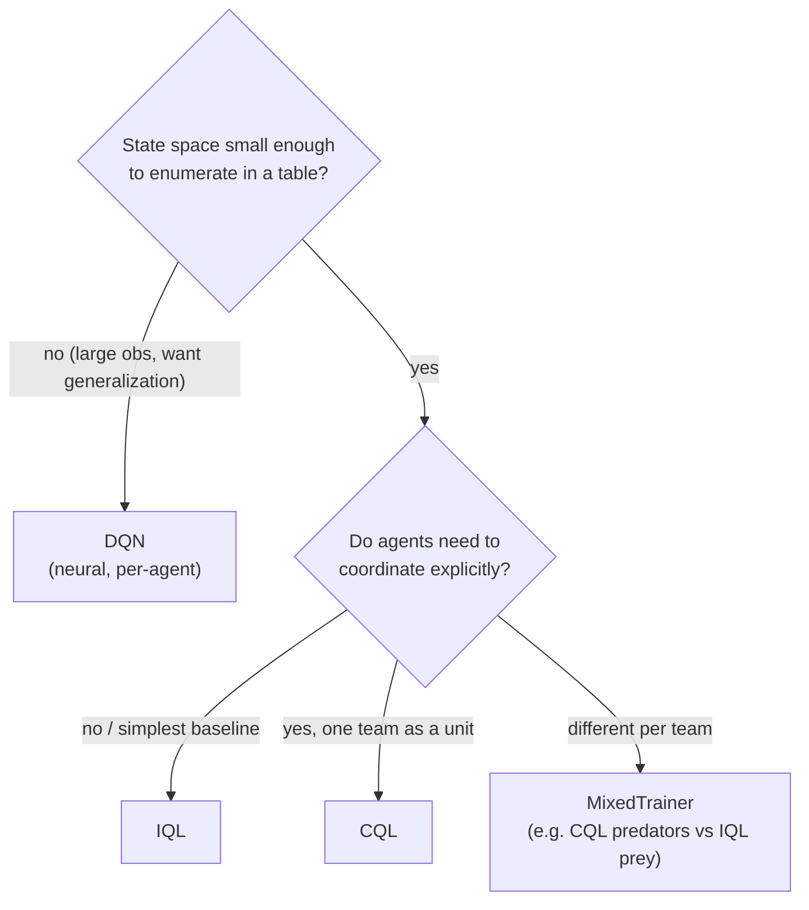

# Algorithms Overview

This project ships four learning **baselines**, all living under
`src/baselines/` and all talking to the environment only through
`env.reset()` / `env.step()`. Three are tabular (they store a Q-table) and one is
a neural network (DQN). This page helps you pick one; each has its own deep-dive.

Before reading these, make sure you are comfortable with
[RL Foundations](../concepts/rl-foundations.md) (Q-learning, the Bellman equation)
and [MARL Theory](../concepts/marl.md) (what changes with many agents).

## The four baselines

| Algorithm | Kind | Coordination | Deep-dive |
| --- | --- | --- | --- |
| **IQL** — Independent Q-Learning | tabular | none — each agent learns alone | [IQL](iql.md) |
| **CQL** — Centralized Q-Learning | tabular | full — one joint Q-table | [CQL & MixedTrainer](cql-mixed.md) |
| **MixedTrainer** | tabular | per-team (IQL or CQL each) | [CQL & MixedTrainer](cql-mixed.md) |
| **DQN** — Deep Q-Network | neural | none — one network per agent | [DQN](dqn.md) → [Variants](../concepts/dqn-variants.md) |

All four are **value-based** (they learn Q-values and act greedily). Policy-gradient
and actor-critic methods (A2C, A3C, SAC) are **not implemented** — see
[Roadmap](#roadmap) below.

## Which one should I use?

Rules of thumb:

- **Start with IQL.** It is the simplest correct baseline and trains fastest.
- **Use CQL** when a team should be treated as one decision-maker — but watch the
  cost: its table grows as `action_dim ^ n_agents`, so keep grids and agent counts
  small.
- **Use MixedTrainer** to study asymmetry, e.g. centralized predators against
  independent prey (exactly the kind of comparison in the
  [research study](../reference/papers.md) built on this environment).
- **Use DQN** when the observation is too large to tabulate or you want a policy
  that generalizes across states; enable [Double/Dueling](../concepts/dqn-variants.md)
  for a stronger variant.

## The shared training contract

Every baseline subclasses `BaseAlgorithm` (`src/baselines/base.py`) and implements:

- `select_actions(observations) -> {agent: action}` — usually ε-greedy over Q.
- `train()` — the episode loop (see [Training Loop](../flows/training-loop.md)).
- `save(path)` / `load(env, config, path)` — checkpointing.
- `evaluate(episodes)` — greedy rollout returning mean episode length and per-agent
  return.

They are wired in by name through the algorithm registry
(`experiment.yaml → algorithm.name`), so switching algorithms is a one-line config
change.

## Roadmap

The following are documented for context but **not implemented** in this
repository. They are policy-gradient / actor-critic methods, a family this tabular
+ DQN testbed deliberately does not cover yet:

- **A2C / A3C** — (Advantage) Actor-Critic (Mnih et al., 2016).
- **SAC** — Soft Actor-Critic (Haarnoja et al., 2018); a discrete-action variant
  would be needed for this environment.

See [Papers & Further Reading](../reference/papers.md) for full citations.
