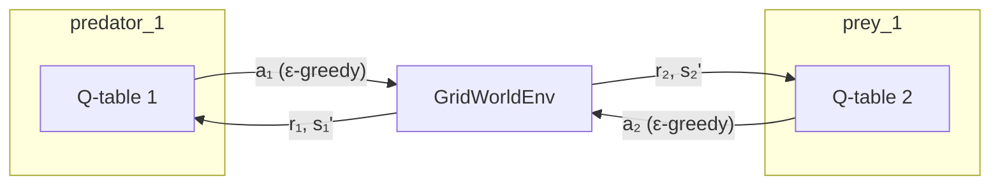

# IQL — Independent Q-Learning

**Independent Q-Learning** is the simplest way to do multi-agent RL: run ordinary
[Q-learning](../concepts/rl-foundations.md#6-q-learning-solving-bellman-by-sampling)
separately for each agent, and let every agent treat all the others as part of the
environment. It is the baseline of record in this project.

## Theory

Each agent $i$ keeps its own Q-function $Q_i(s_i, a_i)$ and updates it with the
standard Q-learning rule from its **own** reward and observations:

$$
Q_i(s_i, a_i) \;\leftarrow\; Q_i(s_i, a_i) + \alpha\big[\, r_i + \gamma \max_{a'} Q_i(s_i', a') - Q_i(s_i, a_i) \,\big]
$$

**What it ignores.** The transition $s_i \to s_i'$ actually depends on what *every*
agent did, not just agent $i$. As the other agents learn, that transition
distribution shifts, so the environment agent $i$ faces is **non-stationary** —
which breaks Q-learning's convergence guarantee (see
[MARL Theory](../concepts/marl.md#non-stationarity)). In practice IQL still learns
useful policies in small environments, which is why it is the default baseline.

## How it works here



Each agent has an independent table and its own update; nothing is shared.

**Implementation:** `src/baselines/IQL/iql.py`.

- **Q-tables** — one `defaultdict` per agent, mapping an encoded state to a vector
  of `action_dim` Q-values: `self.q_tables[agent_id]`.
- **State encoding** — `_encode_state()` turns an observation dict into a hashable
  tuple recursively, so IQL works with *any* observation plugin without assuming a
  shape.
- **Action selection** — `select_actions()` is ε-greedy: random with probability
  `epsilon`, else `argmax` over the agent's Q-vector.
- **Update** — the TD update in `train()`, with the bootstrap cut only on a true
  terminal state (not on a timeout truncation):

```python
q_current  = self.q_tables[agent_id][s][a]
q_next_max = 0.0 if terminal else float(np.max(self.q_tables[agent_id][s_next]))
td_error   = r + self.gamma * q_next_max - q_current
self.q_tables[agent_id][s][a] += self.alpha * td_error
```

## Configuration

Select IQL via `experiment.yaml` (or run `experiment_iql.yaml`):

```yaml
experiment:
  algorithm:
    name: iql
    params:
      alpha: 0.1          # learning rate
      gamma: 0.99         # discount factor
      epsilon: 1.0        # initial exploration
      epsilon_decay: 0.995
      min_epsilon: 0.05
      episodes: 5000
      seed: 42
```

Run it:

```bash
python -m multi_agent_package.scripts.run_iql            # train
python -m multi_agent_package.scripts.run_iql --mode eval --load-path trained_iql.pkl
```

## Worked example

A predator sits one cell from the prey, takes the capturing move, and receives
$r = +100$ into a terminal state. With $Q(s,a) = 10$, $\alpha = 0.25$,
$\gamma = 0.9$:

$$
\text{TD error} = 100 + 0.9 \cdot 0 - 10 = 90, \qquad Q(s,a) \leftarrow 10 + 0.25 \cdot 90 = 32.5
$$

Repeated over episodes, $Q$ for capturing states climbs toward $+100$ and the
greedy policy learns to close in on prey.

## Strengths and limits

| Capability | IQL |
| --- | --- |
| Simple, fast, always applicable | ✅ |
| Coordinate predators explicitly | ⚠️ only implicitly |
| Converge vs. a learning adversary | ❌ not guaranteed (non-stationarity) |
| Generalize to unseen states / grid sizes | ❌ tabular |

For explicit team coordination, see [CQL & MixedTrainer](cql-mixed.md); to drop the
tabular limit, see [DQN](dqn.md).

## Papers

- Watkins & Dayan (1992), *Q-learning* — the single-agent algorithm IQL runs per
  agent.
- Tan (1993), *Multi-Agent Reinforcement Learning: Independent vs. Cooperative
  Agents* — the original independent-learners study.
- Tampuu et al. (2017), *Multiagent cooperation and competition with deep RL* —
  independent learners at scale.

Full list: [Papers & Further Reading](../reference/papers.md).
