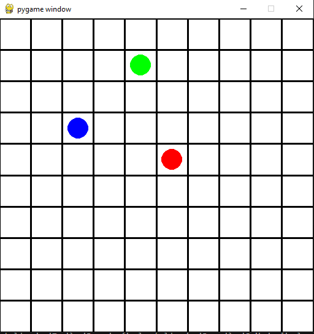

# Concept: GridWorld

## What It Is

The GridWorld is a **bounded 2D discrete grid** — the physical substrate of the simulation. It owns the canonical state of the world: agent positions, obstacle positions, episode progress, and capture events.

It is implemented as `GridWorldEnv` in `src/multi_agent_package/core/gridworld.py` and inherits from `gymnasium.Env`.

<p align="center">
  
</p>

---

## State Model

At any point in an episode, the world state consists of:

| State Variable | Type | Description |
|----------------|------|-------------|
| `_obstacle_location` | `List[np.ndarray]` | Fixed obstacle positions for this episode |
| Each agent's `_agent_location` | `np.ndarray [x,y]` | Current position per agent |
| `_captured_agents` | `List[str]` | Names of all prey captured so far (persistent) |
| `_captured_this_step` | `List[str]` | Prey names captured in the current step only (reset each step) |
| `_capturing_predators` | `set` | Predator names that made a capture this step (reset each step) |
| `_captures_total` | `int` | Total capture events this episode |
| `_episode_steps` | `int` | Timesteps elapsed |
| `capture_threshold` | `int` | Captures needed to terminate (from config, default 1) |
| `max_steps` | `int \| None` | Step limit before truncation (from config) |

The grid itself has no explicit array representation — positions are stored on agents and in the obstacle list, not in a 2D array.

---

## Coordinate System

```
(0,0) ──────────────► x
  │  [ ][ ][ ][ ][ ]
  │  [ ][ ][ ][ ][ ]
  │  [ ][ ][ ][ ][ ]
  ▼  [ ][ ][ ][ ][ ]
  y
```

- Origin `[0,0]` is **top-left**
- X increases right, Y increases down
- Positions are `np.ndarray([x, y], dtype=int32)`
- Grid is `size × size` cells (square, configurable)

---

## Invariants

These properties hold throughout any well-formed episode:

1. **No agent at an obstacle cell** — obstacle placement skips agent start positions; moves into obstacle cells are rejected
2. **Captured agents do not move** — once in `_captured_agents`, an agent's position is frozen
3. **All positions are in-bounds** — the step loop clips any out-of-bounds move back to the current position
4. **Randomness flows through `self.rng` only** — no global random state

> **`allow_cell_sharing` is currently a dead config flag.** It's accepted by `GridWorldEnv.__init__` and stored on the instance, but nothing in `step()` ever reads it — there is no code path that prevents two same-type agents (two predators, or two prey) from sharing a cell, regardless of this setting. Toggling it in `env.yaml` has no observable effect today.

---

## Episode Lifecycle

```
reset()
  │  seed RNG
  │  place obstacles (random, avoiding agent positions)
  │  place agents (random, avoiding obstacles)
  │  zero episode counters
  └► return (initial_obs, info)

step() × N
  │  move all agents simultaneously
  │  detect captures
  │  compute rewards
  │  check termination
  └► return dict {"obs", "reward", "terminated", "truncated", "info"}

close()
  └► release Pygame resources
```

---

## Physics Rules

### Movement
- Each agent picks one action integer; the active `ActionSpace` plugin maps it to a `[dx, dy]` vector (default `discrete_5`: Right, Up, Left, Down, Noop — see [concepts/actions.md](actions.md) for the other two shipped action spaces)
- All moves are processed **simultaneously** (no ordering)
- Out-of-bounds → agent stays in place
- Obstacle cell → agent stays in place
- Captured agent → action ignored, position frozen

### Capture
- After all moves are applied, the grid is scanned for cells containing both a predator and a prey
- If any such cell exists: prey is added to `_captured_agents`
- Multiple captures in one step are all processed

### Termination
- Episode ends when `_captures_total >= capture_threshold` (read from `env.yaml → termination.capture_threshold`)
- Episode truncates when `max_steps is not None` and `_episode_steps >= max_steps`

---

## Extension Contract

The GridWorld is **immutable**. It exposes three injection points for plugins:

```python
env.reward_fn             # callable(env) → Dict[str, float]
env.observation_builder    # callable(env) → Dict[str, dict]
env.action_space_plugin    # ActionSpace instance — .to_direction(int) → np.ndarray
```

All three are `None` at construction and must be set before calling `step()` (`run_from_config.build_environment()` wires them). They are read-only with respect to the environment — plugins may not modify `env` state through these calls.

`run_from_config.build_environment()` additionally wraps the fully-wired env in `SpeedWrapper` before returning it, so in practice most code interacts with a `SpeedWrapper`-wrapped `GridWorldEnv`, not the raw class. See [concepts/wrappers.md](wrappers.md), [specs/observation-builder-spec.md](../specs/observation-builder-spec.md), [specs/reward-function-spec.md](../specs/reward-function-spec.md), and [specs/action-space-spec.md](../specs/action-space-spec.md) for the per-plugin behavioral contracts.
