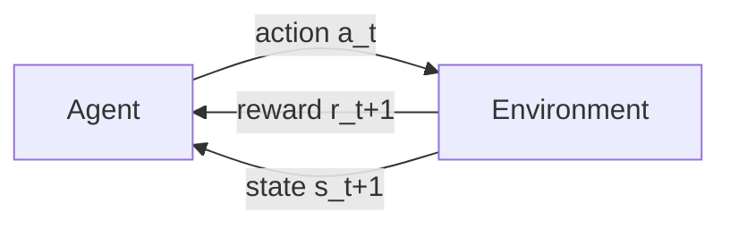

# Reinforcement Learning Foundations

This page builds the theory you need **from scratch**, assuming only basic
probability and algebra. By the end you will understand the ideas the tabular
baselines in this project are built on: Markov Decision Processes, returns and
discounting, value and Q-functions, the Bellman equation, Q-learning, and
ε-greedy exploration. The next page, [MARL Theory](marl.md), extends all of this
to *many* agents.

If you have never seen reinforcement learning before, read this top to bottom.
If you already know single-agent Q-learning, you can skip straight to
[MARL Theory](marl.md).

---

## 1. The reinforcement learning loop

Reinforcement learning (RL) is learning **by trial and error**. An *agent*
interacts with an *environment* in discrete time steps. At each step the agent
observes the current situation (a **state**), chooses an **action**, and the
environment responds with a **reward** and a new state. The agent's goal is to
choose actions that maximize the total reward it collects over time.



In this project the environment is [`GridWorldEnv`](gridworld.md): the state is
where every agent and obstacle sits on the grid, an action is a move
(`up`/`down`/`left`/`right`/`stay`), and the reward encodes capture, step cost,
and any [shaping](rewards.md) you add. The loop is literally `env.reset()` once,
then `env.step(actions)` repeatedly until the episode ends.

---

## 2. Markov Decision Processes (MDPs)

The standard mathematical model of this loop is a **Markov Decision Process**. An
MDP is a tuple $(S, A, P, R, \gamma)$:

- $S$ — the set of **states** (every possible configuration of the world).
- $A$ — the set of **actions** the agent can take.
- $P(s' \mid s, a)$ — the **transition function**: the probability of landing in
  state $s'$ after taking action $a$ in state $s$.
- $R(s, a)$ — the **reward** received for taking $a$ in $s$.
- $\gamma \in [0, 1]$ — the **discount factor** (explained below).

The word **Markov** means the future depends only on the *current* state, not the
full history: knowing $s_t$ is enough to predict what comes next. GridWorld is
Markov because the next positions depend only on the current positions and the
chosen actions.

A **policy** $\pi(a \mid s)$ is the agent's strategy: the probability of choosing
action $a$ in state $s$. Learning = finding a good policy.

---

## 3. Return and discounting

The agent does not maximize the *immediate* reward; it maximizes the **return** —
the total (discounted) reward from now on:

$$
G_t = r_{t+1} + \gamma\, r_{t+2} + \gamma^2 r_{t+3} + \dots = \sum_{k=0}^{\infty} \gamma^k\, r_{t+k+1}
$$

The **discount factor** $\gamma$ controls how much future rewards matter:

- $\gamma = 0$ → the agent is *myopic*, caring only about the next reward.
- $\gamma \to 1$ → the agent is *far-sighted*, valuing long-term reward almost as
  much as immediate reward.

Discounting also keeps the sum finite for never-ending tasks and expresses a
preference for sooner rewards. The baselines here use $\gamma = 0.9$–$0.99$, so a
predator strongly prefers capturing prey **soon** (a reward 20 steps away is worth
only $0.9^{20} \approx 0.12$ of its face value).

---

## 4. Value functions and Q-functions

How good is a state, or a state-action pair, under a policy $\pi$?

- The **state-value function** $V^\pi(s)$ is the expected return starting from
  state $s$ and following $\pi$:
  $V^\pi(s) = \mathbb{E}_\pi[\,G_t \mid s_t = s\,]$.
- The **action-value function** (the **Q-function**) $Q^\pi(s, a)$ is the expected
  return from taking action $a$ in state $s$, then following $\pi$:
  $Q^\pi(s, a) = \mathbb{E}_\pi[\,G_t \mid s_t = s,\, a_t = a\,]$.

The Q-function is what tabular RL learns and stores. If you know $Q^*$ (the
Q-function of the *optimal* policy), acting optimally is trivial: in every state,
pick the action with the highest Q-value. That greedy rule **is** the optimal
policy:

$$
\pi^*(s) = \arg\max_a Q^*(s, a)
$$

In the code, each IQL agent stores exactly this: a table mapping an encoded state
to a vector of Q-values, one per action (`src/baselines/IQL/iql.py`,
`self.q_tables`).

---

## 5. The Bellman equation

Value functions have a beautiful recursive structure: the value of a state is the
immediate reward plus the discounted value of wherever you land next. For the
optimal Q-function this is the **Bellman optimality equation**:

$$
Q^*(s, a) = \mathbb{E}_{s'}\!\left[\, R(s, a) + \gamma \max_{a'} Q^*(s', a') \,\right]
$$

Read it in words: *the value of doing $a$ in $s$ equals the reward you get, plus
$\gamma$ times the value of the best action available in the next state $s'$.*
This single equation is the engine behind almost every value-based RL algorithm,
including all the tabular baselines here and DQN.

---

## 6. Q-learning: solving Bellman by sampling

We usually do **not** know $P$ or $R$ in advance — the agent must learn from
experience. **Q-learning** (Watkins & Dayan, 1992) estimates $Q^*$ by nudging the
current estimate toward the Bellman right-hand side every time it sees a real
transition $(s, a, r, s')$:

$$
Q(s, a) \;\leftarrow\; Q(s, a) + \alpha \underbrace{\big[\, r + \gamma \max_{a'} Q(s', a') - Q(s, a) \,\big]}_{\text{TD error}}
$$

- $\alpha \in (0, 1]$ is the **learning rate** (step size).
- The bracketed quantity is the **temporal-difference (TD) error**: the gap
  between what we *predicted* ($Q(s,a)$) and a better, sampled estimate
  ($r + \gamma \max_{a'} Q(s', a')$, the **TD target**).

Each update shrinks that gap a little. Q-learning is **off-policy**: the
$\max_{a'}$ means it learns the value of acting *optimally* next, even while the
agent is still exploring. This is exactly the update in `src/baselines/IQL/iql.py`:

```python
q_current  = self.q_tables[agent_id][s][a]
q_next_max = 0.0 if terminal else float(np.max(self.q_tables[agent_id][s_next]))
td_error   = r + self.gamma * q_next_max - q_current
self.q_tables[agent_id][s][a] += self.alpha * td_error
```

Note `q_next_max = 0` at a **terminal** state (there is no future once the episode
truly ends) — but *not* on a timeout, where bootstrapping should continue. See the
[Training Loop](../flows/training-loop.md) for why that distinction matters.

### A worked update

Say a predator is one step from the prey. It takes the capturing move and receives
$r = +100$ (capture). Before the update $Q(s, a) = 10$, the next state is terminal
so $\max_{a'} Q(s', a') = 0$, with $\alpha = 0.25$ and $\gamma = 0.9$:

$$
\text{TD error} = 100 + 0.9 \cdot 0 - 10 = 90, \qquad
Q(s, a) \leftarrow 10 + 0.25 \cdot 90 = 32.5
$$

The estimate jumps from 10 toward 100. Repeat over many episodes and $Q(s,a)$
converges to the true capture value.

---

## 7. Exploration vs. exploitation (ε-greedy)

If the agent always picks the current best action (**exploits**), it may never
discover a better one it has not tried. If it always tries random actions
(**explores**), it never uses what it has learned. Balancing the two is the
**exploration–exploitation trade-off**.

The baselines use **ε-greedy**: with probability $\varepsilon$ take a random
action, otherwise take the greedy (best-Q) action.

$$
a =
\begin{cases}
\text{random action} & \text{with probability } \varepsilon \\
\arg\max_a Q(s, a) & \text{otherwise}
\end{cases}
$$

$\varepsilon$ typically starts high (explore a lot early) and **decays** toward a
small floor (exploit what you have learned later). In the configs this is
`epsilon`, `epsilon_decay`, and `min_epsilon`.

---

## 8. When does Q-learning work?

Tabular Q-learning is guaranteed to converge to $Q^*$ when:

1. the state–action space is **finite** (✅ GridWorld is discrete and enumerable),
2. every state–action pair is visited **infinitely often** (✅ with enough
   exploration),
3. the learning rate decays appropriately, and
4. the environment is **stationary** — the transition and reward functions do not
   change over time.

Condition 4 is the one that breaks in multi-agent settings: when *other* agents
are also learning, the environment each agent faces keeps changing. That is the
central theme of the next page.

---

## 9. Where to go next

- **[MARL Theory](marl.md)** — what changes when many agents learn at once:
  joint actions, non-stationarity, and credit assignment.
- **[GridWorld](gridworld.md)** — the concrete environment these ideas run in.
- **[Training Loop](../flows/training-loop.md)** — how the update above is driven
  episode by episode in code.
- The [References](#references) below cite the source for every idea on this page.

### References

- Sutton, R. S. & Barto, A. G. (2018). *Reinforcement Learning: An Introduction*
  (2nd ed.). MIT Press. — the standard textbook for everything above.
- Watkins, C. J. C. H. & Dayan, P. (1992). *Q-learning.* Machine Learning, 8(3).
  — the original Q-learning paper and its convergence proof.
- Bellman, R. (1957). *Dynamic Programming.* — the origin of the Bellman equation.
