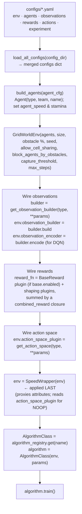

# Flow: Initialization

How the system goes from YAML files on disk to a wired, ready-to-train environment.

---

## Trigger

```bash
python -m multi_agent_package.scripts.run_from_config
```

---

## Flow Diagram



### The reward wiring, in code

The base reward is now a **plugin** added to the pipeline, not a hardcoded call
inside `step()`:

```python
reward_fns = []
# base reward enters here (and only here) when enabled
if reward_cfg["rewards"]["base"]["enabled"]:
    reward_fns.append(get_reward_function("base"))
for r in reward_cfg["rewards"].get("shaping", []):
    reward_fns.append(get_reward_function(r["name"], weight=r.get("weight", 1.0)))

def combined_reward(env):
    total = {ag.agent_name: 0.0 for ag in env.agents}
    for rf in reward_fns:
        for k, v in rf.compute(env).items():
            total[k] += v
    return total

env.reward_fn = combined_reward   # the ONLY source of reward; step() adds none
```

This is the fix for issue #32: a single application path for the base reward, so
it can never be double-counted. Toggling `rewards.base.enabled` genuinely turns
the base reward on or off.

---

## State After Init

| Attribute | Value |
|-----------|-------|
| `env.agents` | List of N Agent instances (positions unset until `reset()`) |
| `env.reward_fn` | Combined closure over the `BaseReward` plugin (if enabled) + configured shaping fns — **all** reward flows through this |
| `env.observation_builder` | Bound `build` method of the configured builder |
| `env.observation_encoder` | Bound `encode` method of the same builder (required by DQN) |
| `env.action_space_plugin` | Configured `ActionSpace` instance |
| `env.rng` | Seeded `np.random.default_rng(seed)` |
| `env._obstacle_location` | Empty list (set on first `reset()`) |

The return value of `build_environment()` is a `SpeedWrapper` wrapping the object
above. All attributes remain reachable through `__getattr__` proxying, plus
`wrapper._speeds` / `_max_stamina` / `_stamina` derived from each agent's
`agent_speed` / `stamina`, and `wrapper._noop_action` (the NOOP index read from
the configured action plugin).

The environment is **not ready to step** until `env.reset()` is called; `reset()`
places obstacles and agents.

---

## Error Modes

| Symptom | Likely Cause |
|---------|-------------|
| `KeyError: 'local_raidus'` | Typo in `observations.yaml` type field |
| `KeyError: 'discrete_X'` | Unknown key in `actions.yaml` type field; check `action_registry.py` |
| `TypeError: 'NoneType' is not callable` on `step()` | `observation_builder` not wired; `reset()`/`step()` called before wiring |
| `ValueError: Algorithm 'X' not registered` | `import baselines` missing before `get()`; auto-registration never ran |
| `KeyError: 'algorithm'` on algo lookup | The real path is the double-nested `configs["experiment"]["experiment"]["algorithm"]` — the parsed file keeps its own top-level `experiment:` key. Not a typo. |
