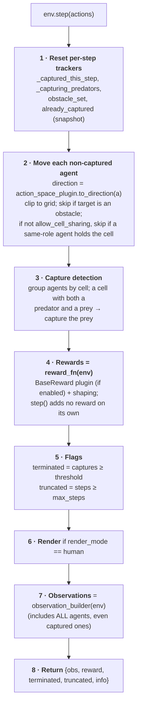

# Flow: Per-Step Pipeline

One call to `env.step(actions)` — what happens inside.

> This describes the **inner** `GridWorldEnv.step()`. In practice,
> `run_from_config.build_environment()` returns a `SpeedWrapper`-wrapped env, so a
> single call to the *outer* `step()` may invoke this inner pipeline multiple
> times in one turn (once per sub-step) when any agent's `agent_speed > 1`. See
> [Wrappers](../concepts/wrappers.md) for the outer mechanics.

---

## Inputs / Outputs

```
Input:  actions: Dict[str, int]
        e.g. {"predator_1": 0, "predator_2": 3, "prey_1": 2}

Output: dict
        {
            "obs":        Dict[str, dict],   ← per-agent observation
            "reward":     Dict[str, float],  ← per-agent reward
            "terminated": bool,              ← _captures_total >= capture_threshold
            "truncated":  bool,              ← _episode_steps >= max_steps
            "info":       dict,              ← per-agent metadata
        }
```

---

## Pipeline



**Coordinate note:** the Y axis increases *downward*. With `DiscreteActionSpace`
`{0:[+1,0], 1:[0,+1], 2:[-1,0], 3:[0,-1], 4:[0,0]}`, action `1` (`[0,+1]`) moves
toward higher Y — visually *down* on screen — and action `3` moves visually up.
Reason from the vectors, not the compass labels.

**Reward note:** the base capture/step-cost/obstacle signal is supplied by the
`BaseReward` **plugin** through `reward_fn`, not by a hardcoded call inside
`step()`. That single application path is what prevents the base reward from being
double-counted. See [Rewards](../concepts/rewards.md).

---

## Simultaneous Movement — Key Properties

All agents move before capture is checked. This means:

**Scenario A: Predator walks onto prey's cell**
```
t=0:  P at [2,2],  R at [3,2]
action: P moves Right (0), R stays (4)
t=1:  P at [3,2],  R at [3,2]  → CAPTURE
```

**Scenario B: Prey walks onto predator's cell**
```
t=0:  P at [3,2],  R at [2,2]
action: P stays (4), R moves Right (0)
t=1:  P at [3,2],  R at [3,2]  → CAPTURE
```

**Scenario C: Simultaneous swap (position exchange)**
```
t=0:  P at [2,2],  R at [3,2]
action: P moves Right (0), R moves Left (2)
t=1:  P at [3,2],  R at [2,2]  → NO CAPTURE
      (they crossed each other; neither ends at the same cell)
```

Scenario C is the "crossing" edge case — agents swap positions without triggering a capture.

---

## What the Step Does NOT Do

- Does not validate that all agents are in `actions` (silently defaults to noop).
- Does not block same-type overlap **when `allow_cell_sharing` is true (the
  default)** — two predators or two prey may share a cell. Set
  `allow_cell_sharing: false` to forbid same-role stacking; predator–prey overlap
  (a capture) is always allowed so the capture mechanic keeps working.
- Does not remove captured agents from `env.agents` or from observations.
- Does not call `env.render()` externally — if `render_mode == "human"`,
  `_render_frame()` is called internally.

---

## MARL Note: Observation of Captured Agents

After capture, prey remain in the observation returned by `step()`. Downstream
algorithms receive observations keyed by ALL agent names including captured ones.
The algorithm is responsible for ignoring or filtering rewards/observations for
captured agents if desired. IQL/CQL do not currently do this — they continue
updating Q-tables for captured prey using zero-movement observations.
