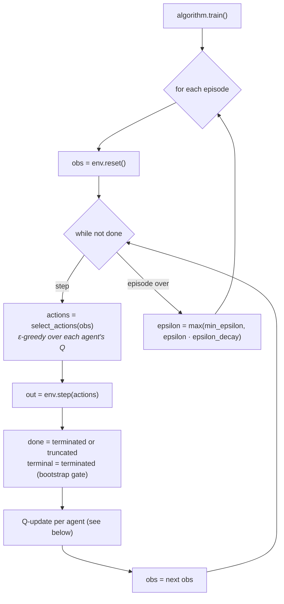

# Flow: Training Loop

How IQL (and the other baselines) progress from an untrained state to a learned
policy. If the update rule below is unfamiliar, read
[RL Foundations](../concepts/rl-foundations.md) first.

---

## Episode Structure



### The per-agent Q-update (IQL)

```
state      = encode(obs[agent])
next_state = encode(next_obs[agent])
r          = rewards[agent]

# Only a TRUE terminal cuts the bootstrap; a timeout truncation does not.
q_next_max = 0.0 if terminal else max(Q[agent][next_state])
td_target  = r + gamma * q_next_max
Q[agent][state][action] += alpha * (td_target - Q[agent][state][action])
```

---

## Key Loop Properties

**Independent learning.** Each agent's Q-table is updated using only its own
reward and observations. Agents share no gradients or Q-values.

**Epsilon decays per episode, not per step.** The first step of every episode
uses the current epsilon.

**States are initialized lazily.** An unvisited `Q[agent][state]` defaults to
zeros, so Q-values start at zero and move negative (step cost) or positive
(capture).

**Terminated vs. truncated.** The bootstrap is cut only when the episode ends in a
true terminal state (`terminated`, i.e. a capture reaching the threshold). On a
timeout (`truncated`), the target keeps the `gamma * max(Q[next_state])` bootstrap
— cutting it there would wrongly teach the agent that states near the time limit
have zero future value. All four baselines follow this rule.

---

## CQL — Centralized Q-Learning

CQL replaces per-agent tables with **one shared Q-table over the joint
state-action space**. Same loop, centralized update:

```
joint_state  = tuple(encode(obs[agent]) for agent in agent_ids)      # all agents
joint_action = a0 * action_dim^(n-1) + a1 * action_dim^(n-2) + ...   # single int
central_r    = sum(rewards[agent] for agent in agent_ids)

q_current  = Q[joint_state][joint_action]
q_next_max = 0.0 if terminal else max(Q[joint_state_next])
Q[joint_state][joint_action] += alpha * (central_r + gamma * q_next_max - q_current)
```

Action selection **marginalises** the joint Q-tensor: reshape the Q-vector to
`(action_dim,)*n_agents`, then average over all axes except agent `i` to get its
per-agent Q-values.

**Trade-off.** CQL stores `action_dim^n_agents` values per joint state (5 actions,
6 agents → 15,625 per entry). Keep grids and agent counts small. See
[Algorithms](../concepts/dqn-variants.md) for the full comparison.

---

## MixedTrainer — Per-Team Assignment

`MixedTrainer` assigns IQL or CQL independently to the predator and prey teams.
CQL teams share one joint table over their team's joint space; IQL agents keep
individual tables. Both update types run within each step.

---

## DQN — Neural Training Loop

Same episode/epsilon structure, but each step does gradient-based optimization
instead of a tabular update:

```
for episode in range(episodes):
    obs, _ = env.reset()
    done = False
    while not done:
        actions = select_actions(obs)          # ε-greedy over each agent's QNetwork
        out = env.step(actions)
        terminal = out["terminated"]           # stored as the buffer's done flag
        for agent_id in agent_ids:
            encode current + next obs via env.observation_encoder
            validate encoded shape == state_dim (raises ValueError otherwise)
            replay_buffers[agent_id].push(state, action, reward, next_state, terminal)
            _optimize_agent(agent_id):
                if len(buffer) < max(min_replay_size, batch_size): return None
                sample a batch; target via target_network (or online-select +
                target-evaluate if double_dqn); SmoothL1Loss; clip grad_norm;
                optimizer.step(); increment shared _train_steps
                every target_update_interval steps: hard-sync target networks
        obs = out["obs"]; done = out["terminated"] or out["truncated"]
    epsilon = max(min_epsilon, epsilon * epsilon_decay)
    if curves_path: append CSV row (episode, epsilon, per-agent reward + mean loss)
```

`_train_steps` is a single counter shared across **all** agents, so
`target_update_interval` counts total optimizer steps across every agent combined.

---

## Checkpoint Save/Load

`IQL`, `CQL`, `MixedTrainer`, and `DQN` all implement `save(path)` and
`load(env, config, path)`:

```python
algo.save("checkpoints/run_1.pkl")
algo2 = IQL.load(env, config, "checkpoints/run_1.pkl")
algo2.evaluate(episodes=10)
```

`DQN.save()` pickles both online and target `state_dict()`s per agent, plus
config/agent_ids/state_dim/action_dim. Note: `DQN.train()` auto-saves to
`save_path` at the end if configured; the tabular trainers do **not** auto-save —
their run scripts call `save()` explicitly after `train()` returns.

---

## What Is Not Logged

The tabular loops (IQL/CQL/MixedTrainer) do not log per-episode rewards, capture
rates, epsilon, or Q-table size. DQN is the exception: with `curves_path` set it
writes a per-episode CSV (`episode`, `epsilon`, per-agent reward/loss), opened and
closed via a `finally` block so partial data survives an exception. For learning
curves on the tabular baselines, add logging around `algorithm.train()`.
