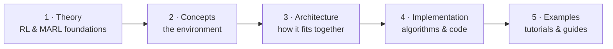

# 🐾 Predator–Prey Gridworld Environment

[](contributing.md)
[](CODE_OF_CONDUCT.md)
[](https://github.com/ProValarous/Predator-Prey-Archetype-Gridworld-Environment/blob/main/LICENSE)

A **discrete, grid-based multi-agent predator–prey environment** built as a
controlled, interpretable, and reproducible testbed for studying coordination,
pursuit–evasion, and emergent behavior in **Multi-Agent Reinforcement Learning
(MARL)**.

<p align="center">
  
</p>
<p align="center"><em>A speed-2 predator chasing a speed-1 prey around obstacles until capture (<code>configs/dqn_1v1</code>).</em></p>

---

## Start here: the learning path

This documentation is written to take an undergraduate from **first principles**
all the way to **running and extending real experiments**. Read it in this order:



| Step | You will learn | Start with |
| --- | --- | --- |
| 1. **Theory** | MDPs, the Bellman equation, Q-learning, then what changes with many agents | [RL Foundations](concepts/rl-foundations.md) → [MARL Theory](concepts/marl.md) |
| 2. **Concepts** | The gridworld, agents, observations, rewards, actions, wrappers | [GridWorld](concepts/gridworld.md) |
| 3. **Architecture** | The layered design and how a step flows through it | [Architecture](overview/architecture.md) |
| 4. **Implementation** | How each learning algorithm works, with code pointers | [Algorithms](algorithms/index.md) |
| 5. **Examples** | Train, watch, interpret, and extend an experiment | [Quickstart](guides/quickstart.md) |

New to the project? The [Student Reading Guide](student-guide.md) gives a
week-by-week path.

---

## What this project optimizes for

* **Interpretability** — state and action spaces are small and fully enumerable,
  so every transition, reward, and capture can be traced by hand.
* **Modularity** — observations, rewards, action spaces, and algorithms are
  independent plugins wired through registries; swap one without touching the rest.
* **Reproducibility** — an experiment is fully determined by a YAML config plus a
  seed: identical configuration yields identical trajectories.

It is a *controlled laboratory* for understanding MARL, not a high-performance
training platform. See the [Mission](mission.md) for the full rationale.

---

## Quick start

```bash
git clone https://github.com/ProValarous/Predator-Prey-Archetype-Gridworld-Environment.git
cd Predator-Prey-Archetype-Gridworld-Environment

python -m venv .venv
source .venv/bin/activate        # Windows: .venv\Scripts\Activate.ps1

pip install -e .

# Train the default experiment (3 predators vs 3 prey, IQL)
python -m multi_agent_package.scripts.run_from_config
```

### Minimal example

```python
from multi_agent_package.core.gridworld import GridWorldEnv
from multi_agent_package.core.agent import Agent

# Agent(agent_type, agent_team, agent_name)
predator = Agent("predator", "predator_1", "Hunter")
prey = Agent("prey", "prey_1", "Runner")

env = GridWorldEnv(agents=[predator, prey], size=8, seed=42)

obs, info = env.reset()
done = False
while not done:
    actions = {"Hunter": 4, "Runner": 4}          # 4 = NOOP for every action space
    out = env.step(actions)                        # returns a dict, not a tuple
    done = out["terminated"] or out["truncated"]

env.close()
```

See the [Quickstart](guides/quickstart.md) for a full install → train → evaluate
walkthrough, and the [First Experiment tutorial](guides/quickstart.md) to watch
agents learn.

---

## Citation

If you use this environment in your research, teaching, or projects, please cite it:

```bibtex
@misc{predatorpreygridworld,
  author       = {Ahmed Atif and Nehal Naeem Haji and Muhammad Affan and Areesha Kashif and Musab1Blaser and afshadGit},
  title        = {Predator-Prey Gridworld Environment},
  year         = {2025},
  howpublished = {\url{https://github.com/ProValarous/Predator-Prey-Archetype-Gridworld-Environment}},
  note         = {A discrete testbed for studying Multi-Agent Reinforcement Learning dynamics.}
}
```

## License

Licensed under the [Apache-2.0 License](https://github.com/ProValarous/Predator-Prey-Archetype-Gridworld-Environment/blob/main/LICENSE).
