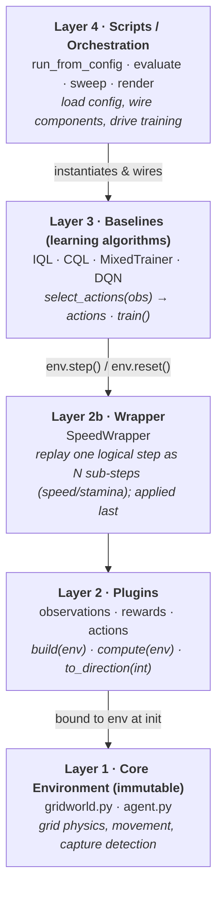
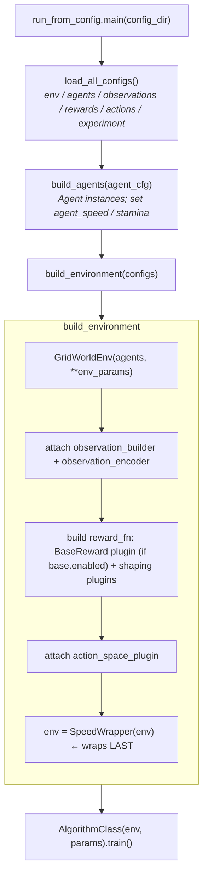
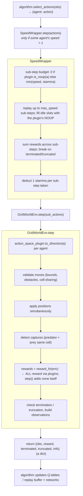
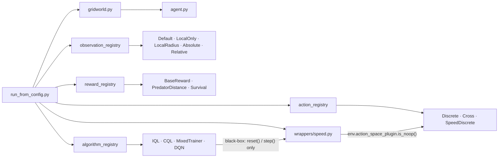

# System Architecture

## Layered Architecture

The system is organized into horizontal layers. Each layer depends only on the
layer below it and communicates through a well-defined interface.



Layer 4 wires everything from config and drives training. Layer 3 algorithms see
the environment only through `reset()` / `step()`. The `SpeedWrapper` (Layer 2b)
sits between them and the core, expanding a logical step into sub-steps. The
plugins (Layer 2) are bound to the core env at build time. The core (Layer 1) is
immutable and never imports upward.

---

## Core Package Structure

```
src/
├── multi_agent_package/          # Environment package
│   ├── core/
│   │   ├── gridworld.py          # GridWorldEnv — central simulation
│   │   └── agent.py              # Agent — identity + movement
│   ├── observations/
│   │   ├── base.py               # ObservationBuilder (abstract)
│   │   ├── default.py            # Full global view (distances)
│   │   ├── absolute.py           # World-frame coordinates
│   │   ├── relative.py           # Egocentric coordinates
│   │   ├── local_only.py         # Own position only
│   │   └── local_radius.py       # Partial: Manhattan radius filter
│   ├── rewards/
│   │   ├── base.py               # RewardFunction (abstract)
│   │   ├── base_reward.py        # BaseReward plugin — the ONLY path for the base reward
│   │   ├── predator_distance.py  # -weight * manhattan_dist_to_nearest_prey
│   │   └── survival_reward.py    # +weight per step for prey
│   ├── actions/
│   │   ├── base.py               # ActionSpace (abstract) + is_noop()
│   │   ├── discrete_actions.py   # DiscreteActionSpace — 5 actions (R/U/L/D/Noop)
│   │   ├── cross_actions.py      # CrossActionSpace — 4 diagonals + Noop
│   │   └── speed_discrete.py     # SpeedDiscreteActionSpace — discrete_5 + to_moves()
│   ├── wrappers/
│   │   ├── __init__.py           # exports SpeedWrapper
│   │   └── speed.py              # SpeedWrapper — per-agent speed/stamina sub-stepping
│   ├── registry/
│   │   ├── observation_registry.py
│   │   ├── reward_registry.py
│   │   └── action_registry.py
│   └── scripts/
│       ├── run_from_config.py    # Generic entrypoint (algorithm chosen via YAML)
│       ├── run_iql.py  run_cql.py  run_mixed.py  run_dqn.py   # per-algorithm train/eval CLIs
│       ├── evaluate.py           # Metrics (episode length + per-agent return); loads a checkpoint
│       ├── render.py             # Single-episode visualization (random or a loaded policy)
│       └── sweep.py              # CLI-driven sweep over an observation config param
│
├── baselines/
│   ├── base.py                   # BaseAlgorithm (abstract) + evaluate()
│   ├── __init__.py               # Auto-registers IQL, CQL, MixedTrainer, DQN
│   ├── IQL/  CQL/  MIXED/        # tabular algorithms + standalone CLIs
│   ├── DQN/
│   │   ├── dqn.py                # DQN class (Double DQN, Dueling DQN flags)
│   │   ├── q_network.py          # QNetwork / DuelingQNetwork (PyTorch)
│   │   ├── replay_buffer.py      # Fixed-capacity numpy ring buffer
│   │   └── curve_recorder.py     # Per-episode training-curve CSV writer
│   └── registry/
│       └── algorithm_registry.py
│
configs/                          # YAML experiment definitions (env/agents/obs/rewards/actions/experiment*)
tests/                            # pytest suite: registries, plugin contracts, architecture rules, e2e
```

---

## Component Interaction at Runtime

### Initialization sequence

`run_from_config.main()` loads the YAML, builds agents, wires the environment, and
starts training. The `SpeedWrapper` is applied **last**, so every plugin is
already attached to the inner env before wrapping.



### Per-step sequence



> The base reward now enters through the `BaseReward` **plugin** (added to
> `reward_fn` when `rewards.base.enabled` is true), not through a hardcoded call
> inside `step()`. This gives it a single application path and prevents
> double-counting — see [Rewards](../concepts/rewards.md) and
> [DQN Variants](../concepts/dqn-variants.md).

---

## Extension Points

The architecture has four plugin extension points, plus wrappers as a less common fifth:

| Extension Point | Where | How |
|----------------|-------|-----|
| Custom observation | `observations/` | Subclass `ObservationBuilder`, implement `build(env)` + `encode(obs, env)`, register in `observation_registry.py` |
| Custom reward | `rewards/` | Subclass `RewardFunction`, implement `compute(env)`, register in `reward_registry.py` |
| Custom action space | `actions/` | Subclass `ActionSpace`, implement `to_direction()` + properties, register in `action_registry.py` (all three registries validate the class is a proper subclass) |
| Custom algorithm | `baselines/` | Subclass `BaseAlgorithm`, implement `select_actions()` + `train()`, register in `algorithm_registry.py` |
| Custom wrapper | `wrappers/` | Follow `SpeedWrapper`: wrap an env, proxy unmodified attributes via `__getattr__`, override only `step()`/`reset()`. No registry — applied explicitly in `build_environment()` |

---

## Dependency Graph



No circular dependencies. The core never imports from plugins or baselines, and
`SpeedWrapper` asks the configured action plugin whether an action is a NOOP
rather than hardcoding one.
