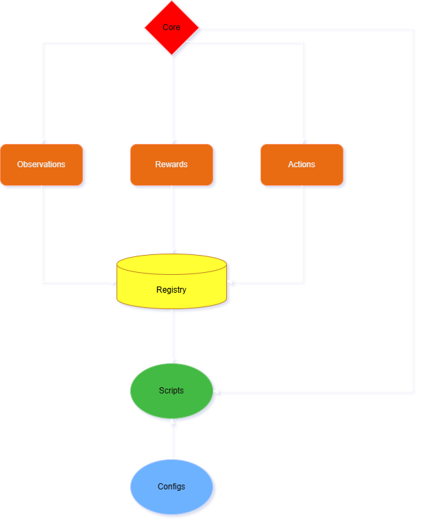

# Project Overview

<p align="center">
  
</p>

## Purpose

The Predator-Prey Archetype Gridworld is a **discrete, deterministic multi-agent reinforcement learning (MARL) environment** built as a controlled research testbed. Its primary purpose is to enable mechanistic study of coordination, pursuit-evasion, and emergent behavior in multi-agent settings without the confounding variables present in more complex simulators.

---

## Research Goals

| Goal | Description |
|------|-------------|
| **Reproducibility** | All experiments are fully seeded and config-driven. Two runs with the same seed and config produce identical trajectories. |
| **Interpretability** | State and action spaces are small and enumerable. Every transition can be traced manually. |
| **Modularity** | Observation models, reward structures, and learning algorithms are independently swappable via YAML config—no code changes required. |
| **Educability** | The codebase is structured to teach students the separation between environment dynamics, perception, incentives, and learning. |

---

## Scope

**In scope:**
- Discrete grid-based multi-agent dynamics
- Configurable predator and prey teams
- Pluggable observation, reward, and action-space systems
- Per-agent speed/stamina mechanics via wrappers
- Tabular Q-learning baselines (IQL, CQL, MixedTrainer) and a PyTorch DQN baseline (including Double DQN and Dueling DQN)
- Pygame-based visualization

**Out of scope:**
- Continuous state/action spaces
- Policy-gradient or actor-critic methods (PPO, SAC, MADDPG)
- Networked or distributed training
- Photorealistic rendering

---

## System at a Glance

```
┌─────────────────────────────────────────────────────────┐
│                    YAML Configuration                   │
│     env.yaml  agents.yaml  observations.yaml            │
│     rewards.yaml  experiment.yaml                       │
└────────────────────────┬────────────────────────────────┘
                         │ parsed by run_from_config.py
                         ▼
┌─────────────────────────────────────────────────────────┐
│                  Environment Layer                      │
│   GridWorldEnv  ←→  Agent (×N)                         │
│   (core/ — immutable)                                   │
│                                                         │
│  ┌────────────┐ ┌────────────┐ ┌───────────────────┐  │
│  │Observations│ │  Rewards   │ │  Action Spaces     │  │
│  │(5 builders)│ │(3 funcs)   │ │(3 spaces)          │  │
│  └────────────┘ └────────────┘ └───────────────────┘  │
│              ↓ wrapped by SpeedWrapper (speed/stamina) │
└────────────────────────┬────────────────────────────────┘
                         │ env.step() / env.reset()
                         ▼
┌─────────────────────────────────────────────────────────┐
│                  Baselines Layer                        │
│  IQL (tabular)  CQL (tabular, centralized)              │
│  MixedTrainer (per-team)  DQN (PyTorch, +Double/Dueling)│
│   (baselines/ — extensible)                             │
└─────────────────────────────────────────────────────────┘
```

---

## Key Design Invariants

1. **`core/` is immutable.** `gridworld.py` and `agent.py` are never modified by contributors. All variation comes through configuration and plugins.

2. **All randomness is seeded.** The environment uses `np.random.default_rng(seed)` exclusively. No global random state.

3. **Plugins are self-contained.** Observation builders and reward functions are pure-ish: they read env state but do not modify it.

4. **Config drives everything.** If something cannot be expressed in YAML, it should probably be a new plugin, not a code change.

---

## Further Reading

- [Architecture deep-dive](architecture.md)
- [Glossary](glossary.md)
- [Data flows](../flows/init-flow.md)
