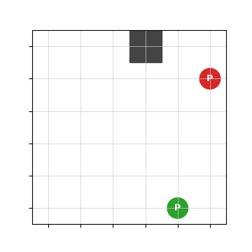
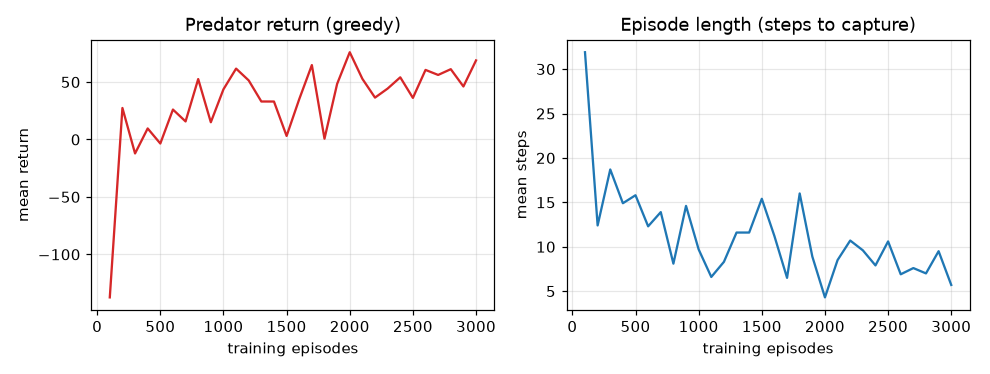

# Tutorial: Your First Experiment

This is the end-to-end walkthrough: install the package, train predators to catch
prey, **watch them learn**, read the learning curves, evaluate the trained policy,
and then change one thing and see the effect. By the end you will have run a real
MARL experiment and know how to interpret it.

Prerequisites: skim [RL Foundations](../concepts/rl-foundations.md) (what
Q-learning is) and [GridWorld](../concepts/gridworld.md) (what the environment is).

---

## 1. Install

```bash
git clone https://github.com/ProValarous/Predator-Prey-Archetype-Gridworld-Environment.git
cd Predator-Prey-Archetype-Gridworld-Environment
python -m venv .venv
source .venv/bin/activate        # Windows: .venv\Scripts\Activate.ps1
pip install -e .
```

Confirm it worked:

```bash
python -c "import multi_agent_package, baselines; print('ok')"
```

---

## 2. Train the default experiment

The default config (`configs/experiment.yaml`) is 3 predators vs 3 prey learning
with [IQL](../algorithms/iql.md). Train it:

```bash
python -m multi_agent_package.scripts.run_iql
```

You will see periodic log lines as epsilon decays and the agents improve. Training
is tabular and fast. When it finishes, it writes a checkpoint (`trained_iql.pkl`).

---

## 3. Watch the learned behavior

Here is a trained predator (red) closing in on prey (green) around obstacles, one
greedy episode end to end. This is a **minimal 1v1 illustration** produced offscreen
by `scripts/make_docs_media.py` (a tabular Q-learning predator chasing a
random-moving prey), so it shows the learning outcome clearly:

<p align="center">
  
</p>

The episode ends the moment a predator lands on the prey's cell (a capture). Early
in training the predator wanders; after training it moves purposefully toward the
prey. To watch a live episode yourself (opens a window):

```bash
python -m multi_agent_package.scripts.render --load-path trained_iql.pkl
```

---

## 4. Read the learning curves

"Is it actually learning?" is answered by two curves: the **return** the predator
earns and the **episode length** (how many steps until capture). As learning
proceeds, return should rise and episode length should fall (captures happen
sooner).

<p align="center">
  
</p>

- **Return going up** → the policy is finding more reward (captures, less step cost).
- **Episode length going down** → the predator captures faster, the clearest sign
  of a good pursuit policy.
- A **noisy, flat** curve usually means too little exploration or too few episodes
  — raise `episodes` or `epsilon`/`epsilon_decay`.

These images are produced by `scripts/make_docs_media.py`, which trains a small
tabular Q-learning predator (against a random-moving prey) offscreen and captures
both the episode and the curves. Run it yourself to regenerate them:

```bash
python scripts/make_docs_media.py
```

---

## 5. Evaluate

Measure the trained policy greedily (no exploration) and print summary metrics:

```bash
python -m multi_agent_package.scripts.run_iql --mode eval --load-path trained_iql.pkl
```

This prints the mean episode length and mean per-agent return over several
episodes. (`evaluate.py` does the same from a config; pass `--load-path` so it
evaluates a *trained* model rather than a fresh one.)

---

## 6. Change one thing and compare

The whole point of this testbed is controlled, one-variable-at-a-time change. Try
any of these and re-run:

- **Reward shaping.** In `configs/rewards.yaml`, add or remove the
  `predator_distance` shaping term and compare how fast episodes shorten. See
  [Rewards](../concepts/rewards.md).
- **Observation model.** In `configs/observations.yaml`, switch `type` between
  `local_radius` (partial view) and `absolute` (full view). See
  [Observations](../concepts/observations.md).
- **Algorithm.** Swap `name: iql` for `cql` or `mixed` in the experiment config.
  See [Algorithms](../algorithms/index.md).
- **Embodiment.** Give predators or prey different `speed`/`stamina` in
  `configs/agents.yaml` (honored by the [SpeedWrapper](../concepts/wrappers.md)).

Because runs are fully seeded, the only thing that changed is the variable you
touched — that is what makes the comparison meaningful.

---

## Where to go next

- Build a custom [observation](../guides/custom-observation.md),
  [reward](../guides/custom-reward.md), or [action space](../guides/custom-action.md).
- Copy-paste ready configs from the [Config Recipes](../guides/config-recipes.md).
- Understand the full picture in [Architecture](../overview/architecture.md).
