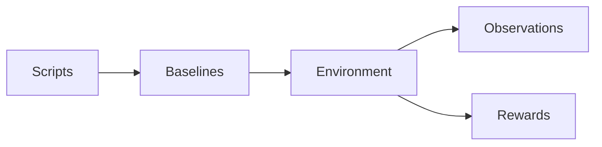
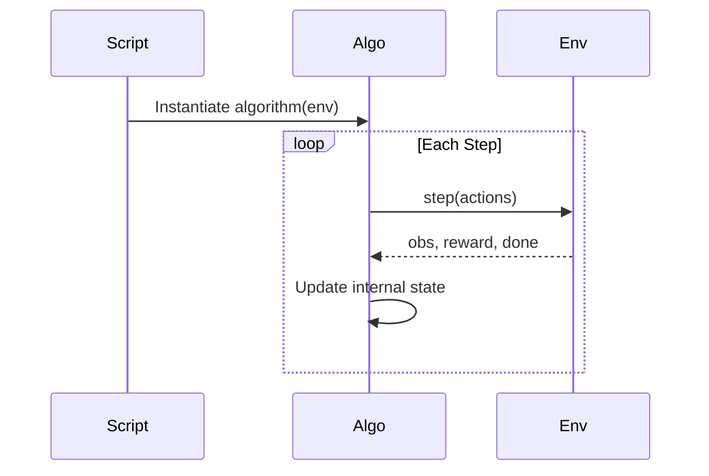

# 🧠 Baselines

### The Learning Layer

This package implements **learning algorithms** for the Predator–Prey Gridworld system.

It does **not** define:

* 🟥 Environment dynamics
* 🟧 Observations (perception)
* 🟨 Rewards (incentives)

Those belong to `multi_agent_package`.

This module implements only:

```text
Learning
```

---

# 🧭 Conceptual Position

The full system follows:

```text
Environment dynamics → Perception → Incentives → Learning
```

`baselines` implements:

```text
Learning
```

Everything before it is treated as a black box.

---

# 🏗 Structural Separation



### Rules

* Algorithms never access internal environment state
* Algorithms never compute rewards manually
* Algorithms never build observations manually
* Algorithms only consume what `env.step()` returns

---

# 🔁 Interaction Contract

Every algorithm interacts through:

```python
env.reset()
env.step(actions)
```

Execution flow:



The environment controls:

* State transitions
* Reward computation
* Observation construction

The algorithm controls:

* Action selection
* Parameter updates
* Exploration

---

# 📂 Directory Structure

```text
baselines/
│
├── base.py            # BaseAlgorithm interface
├── registry/          # Algorithm registry
│
├── iql/               # Independent Q-Learning
│
├── cql/               # Centralized Q-Learning
│
└── README.md
```

---

# 📜 BaseAlgorithm Contract

All algorithms must implement:

```python
select_actions(observations: dict) -> dict
train() -> None
```

Optional:

```python
evaluate(episodes: int)
```

Algorithms must:

* Operate only on observations returned by the environment
* Use rewards returned by the environment
* Respect deterministic seeding
* Avoid side effects on environment internals

---

# 📚 Included Algorithms

## 🟦 IQL — Independent Q-Learning

* One Q-table per agent
* Decentralized updates
* Epsilon-greedy exploration
* Tabular implementation

### When to Use

* Studying decentralized learning
* Partial observability experiments
* Independent policy adaptation

---

## 🟪 CQL — Centralized Q-Learning (Tabular)

* Joint state-action table
* Centralized learning signal
* Suitable for small state spaces

### When to Use

* Coordination-heavy tasks
* Small grid sizes
* Studying centralized vs decentralized gaps

---

# 🔌 Algorithm Registry

Algorithms are registered by name:

```python
register("iql", IQL)
```

This enables:

* YAML-driven selection
* Swappable learning methods
* No modification to scripts

---

# 🎛 Configuration-Driven Training

Training configuration is external.

Example:

```yaml
algorithm:
  name: iql
  epsilon: 0.1
  alpha: 0.5
  gamma: 0.99
```

Changing learning behavior requires changing configuration — not environment code.

---

# 🔁 Reproducibility Guarantees

Learning behavior is fully determined by:

* Environment seed
* Algorithm hyperparameters
* Deterministic update rules

Identical configuration → identical learning trajectory.

If two runs diverge, something is wrong.

---

# 🧩 Extension Rules

To add a new algorithm:

1. Create a new folder
2. Inherit from `BaseAlgorithm`
3. Implement required methods
4. Register it in the registry

No environment changes required.

---

# 🎯 What This Package Enables

With these baselines you can study:

* Centralized vs decentralized learning
* Coordination emergence
* Credit assignment challenges
* Reward shaping effects on convergence
* Sample efficiency comparisons

This package is intentionally:

* Simple
* Inspectable
* Tabular-first
* Education-friendly

It is not optimized for scale.

It is optimized for understanding.

---

# ▶ Running Training

From repository root:

```bash
python -m baselines.run_training
```

(Assumes correct configuration.)

---

# 🧠 Design Philosophy

This package isolates learning from environment design.

The goal is:

* Structural clarity
* Safe experimentation
* Reproducibility
* Educational transparency

Learning is modular.

Environment dynamics remain untouched.

---

# Final Summary

`baselines` implements the learning layer of the Predator–Prey Gridworld system.

It consumes observations and rewards from the environment and produces adaptive behavior.


