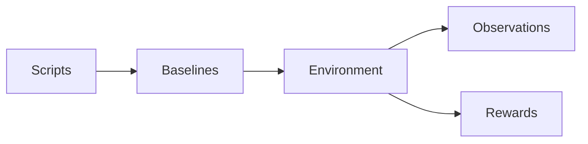
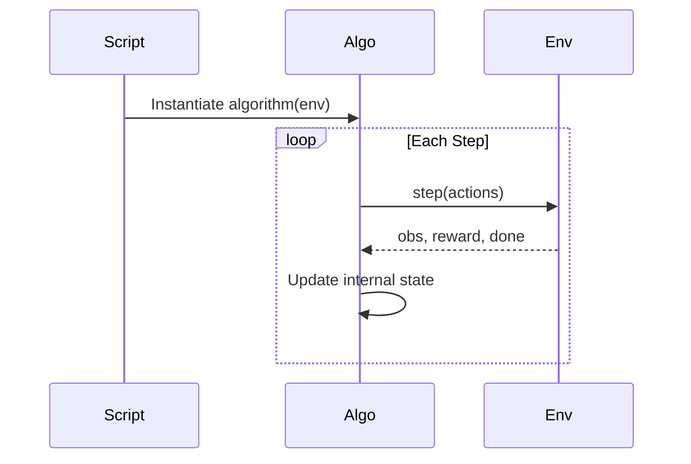

# 🧠 Baselines

### The Learning Layer

This package implements **learning algorithms** for the Predator–Prey Gridworld system.

It does **not** define:

* 🟥 Environment dynamics
* 🟧 Observations (perception)
* 🟨 Rewards (incentives)

Those belong to `multi_agent_package`.

This module implements only:

```text
Learning
```

---

# 🧭 Conceptual Position

The full system follows:

```text
Environment dynamics → Perception → Incentives → Learning
```

`baselines` implements:

```text
Learning
```

Everything before it is treated as a black box.

---

# 🏗 Structural Separation



### Rules

* Algorithms never access internal environment state
* Algorithms never compute rewards manually
* Algorithms never build observations manually
* Algorithms only consume what `env.step()` returns

---

# 🔁 Interaction Contract

Every algorithm interacts through:

```python
env.reset()
env.step(actions)
```

Execution flow:



The environment controls:

* State transitions
* Reward computation
* Observation construction

The algorithm controls:

* Action selection
* Parameter updates
* Exploration

---

# 📂 Directory Structure

```text
baselines/
│
├── base.py            # BaseAlgorithm interface
├── __init__.py        # Auto-registers IQL, CQL, MixedTrainer, DQN
├── registry/          # Algorithm registry
│
├── IQL/               # Independent Q-Learning  (iql.py + CLI)
│
├── CQL/               # Centralized Q-Learning  (cql.py + CLI)
│
├── MIXED/             # MixedTrainer — per-team IQL/CQL  (mix_train.py + CLI)
│
├── DQN/               # Deep Q-Network, PyTorch (dqn.py + CLI, q_network.py, replay_buffer.py)
│
└── README.md
```

---

# 📜 BaseAlgorithm Contract

All algorithms must implement:

```python
select_actions(observations: dict) -> dict
train() -> None
```

Optional:

```python
evaluate(episodes: int)
```

Algorithms must:

* Operate only on observations returned by the environment
* Use rewards returned by the environment
* Respect deterministic seeding
* Avoid side effects on environment internals

---

# 📚 Included Algorithms

## 🟦 IQL — Independent Q-Learning

* One Q-table per agent
* Decentralized updates
* Epsilon-greedy exploration
* Tabular implementation

### When to Use

* Studying decentralized learning
* Partial observability experiments
* Independent policy adaptation

---

## 🟪 CQL — Centralized Q-Learning (Tabular)

* Joint state-action table shared across **all** agents in the environment
* Centralized learning signal (reward = sum of every agent's reward)
* Action selection marginalises the joint Q-tensor to get per-agent Q-values
* Suitable for small state spaces — scales as `action_dim^n_agents`

> ⚠️ **Naming collision:** this is *not* the well-known offline-RL algorithm "Conservative Q-Learning" that shares the same CQL acronym in the broader literature. This is plain online joint-action tabular Q-learning — no conservative/pessimistic regularization, no offline dataset.

### When to Use

* Coordination-heavy tasks
* Small grid sizes
* Studying centralized vs decentralized learning gaps

---

## 🟫 MixedTrainer — Per-Team Algorithm Assignment

* Predators and prey can use different algorithms (IQL or CQL)
* Configured via `predator_algo` / `prey_algo` params
* CQL teams get one joint table over *that team's* members only (not the whole env, unlike standalone CQL)
* Useful for asymmetric baselines

### When to Use

* Studying predator-prey algorithm asymmetry
* Ablations where one team is centralized, the other is not

---

## 🟩 DQN — Deep Q-Network (PyTorch)

* One independent `QNetwork` (or `DuelingQNetwork`) + target network + replay buffer per agent — architecturally like IQL, with a function approximator instead of a table
* Requires `env.observation_encoder` (a callable `encode(obs, env) -> array-like`) to already be attached — `run_from_config.build_environment()` does this automatically
* `action_dim` is inferred from `env.action_space_plugin.n_actions` and validated (raises `ValueError` on mismatch) rather than taken as a bare config default
* Optional `double_dqn: true` — decouples bootstrap action selection (online network) from evaluation (target network), reducing overestimation bias
* Optional `dueling: true` — splits the network into value `V(s)` and advantage `A(s,a)` streams, recombined as `Q(s,a) = V(s) + (A(s,a) - mean_a A(s,a))`
* Supports per-episode CSV logging via `curves_path` (reward/loss/epsilon) — the only one of the four baselines that does

### When to Use

* Function-approximation baseline instead of tabular Q-learning
* Larger observation spaces where tabular state encoding becomes impractical
* Studying Double/Dueling DQN variants against vanilla DQN

---

# 🔌 Algorithm Registry

Algorithms are registered by name:

```python
register("iql", IQL)
```

This enables:

* YAML-driven selection
* Swappable learning methods
* No modification to scripts

---

# 🎛 Configuration-Driven Training

Training configuration is external.

Example:

```yaml
# configs/experiment_iql.yaml
experiment:
  algorithm:
    name: iql
    params:
      epsilon: 1.0
      alpha: 0.1
      gamma: 0.99
      episodes: 1000
```

Changing learning behavior requires changing configuration — not environment code.

---

# 🔁 Reproducibility Guarantees

Learning behavior is fully determined by:

* Environment seed
* Algorithm hyperparameters
* Deterministic update rules

Identical configuration → identical learning trajectory.

If two runs diverge, something is wrong.

---

# 🧩 Extension Rules

To add a new algorithm:

1. Create a new folder
2. Inherit from `BaseAlgorithm`
3. Implement required methods
4. Register it in the registry

No environment changes required.

---

# 🎯 What This Package Enables

With these baselines you can study:

* Centralized vs decentralized learning
* Coordination emergence
* Credit assignment challenges
* Reward shaping effects on convergence
* Sample efficiency comparisons

This package is intentionally:

* Simple
* Inspectable
* Tabular-first
* Education-friendly

It is not optimized for scale.

It is optimized for understanding.

---

# ▶ Running Training

From `src/`:

```bash
# Config-driven (each reads its own configs/experiment_<algo>.yaml)
PYTHONPATH=src python -m multi_agent_package.scripts.run_iql
PYTHONPATH=src python -m multi_agent_package.scripts.run_cql
PYTHONPATH=src python -m multi_agent_package.scripts.run_mixed
PYTHONPATH=src python -m multi_agent_package.scripts.run_dqn
PYTHONPATH=src python -m multi_agent_package.scripts.run_dqn --config-dir configs/dqn_1v1   # double+dueling example

# Direct CLI (all hyperparams as flags; builds its own GridWorldEnv, bypassing run_from_config)
python -m baselines.IQL.iql --episodes 1000 --alpha 0.1 --save-path trained_iql.pkl
python -m baselines.CQL.cql --episodes 1000 --alpha 0.1 --save-path trained_cql.pkl   # NOT --cql-alpha
python -m baselines.MIXED.mix_train --predator-algo cql --prey-algo iql --episodes 1000
python -m baselines.DQN.dqn --episodes 1000 --hidden-layers 64 64 --save-path trained_dqn.pkl
```

---

# 🧠 Design Philosophy

This package isolates learning from environment design.

The goal is:

* Structural clarity
* Safe experimentation
* Reproducibility
* Educational transparency

Learning is modular.

Environment dynamics remain untouched.

---

# Final Summary

`baselines` implements the learning layer of the Predator–Prey Gridworld system.

It consumes observations and rewards from the environment and produces adaptive behavior.


