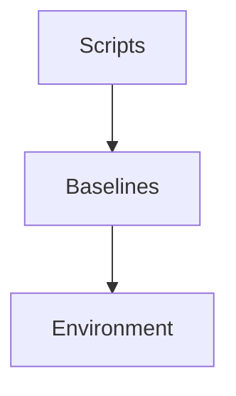
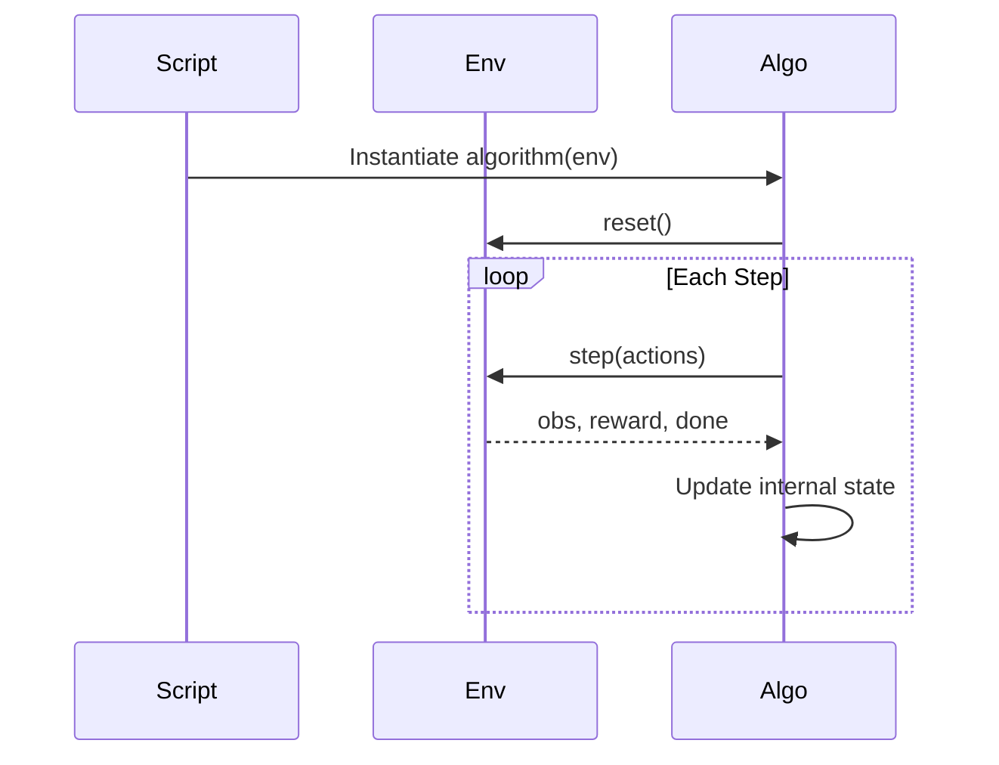

# 🧠 Baselines Module

The `baselines` module contains learning algorithms for the Predator–Prey GridWorld environment.

This module implements **learning only**.

It does not define environment dynamics, rewards, or observations.

Those belong to `multi_agent_package`.

---

# 🧭 Conceptual Role

The full system follows:

```

Physics → Perception → Incentives → Learning

````

The `baselines` module implements the **Learning** layer.

It consumes outputs from the environment:

```python
env.reset()
env.step(actions)
````

It never accesses internal environment state directly.

---

# 🏗 Architecture

## Structural View



* Scripts instantiate algorithms via registry.
* Algorithms interact only with the environment interface.
* Algorithms do not depend on observation or reward registries.

---

## Execution Flow



Algorithms treat the environment as a black box.

---

# 📂 Structure

```
baselines/
├── base.py                # BaseAlgorithm interface
├── registry/              # Algorithm registry
├── iql/                   # Independent Q-Learning
├── cql/                   # Centralized Q-Learning
└── README.md
```

---

# 🔌 Registry

Algorithms are registered by name:

```python
register("iql", IQL)
```

This allows selection via configuration without modifying code.

---

# 📜 BaseAlgorithm Contract

Every algorithm must implement:

```python
select_actions(observations: dict) -> dict
train() -> None
```

Optionally:

```python
evaluate(episodes: int)
```

Algorithms must:

* Not modify environment internals
* Not compute rewards manually
* Not construct observations manually
* Only consume what `env.step()` returns

---

# 📚 Included Algorithms

### IQL – Independent Q-Learning

* One Q-table per agent
* Decentralized learning
* Epsilon-greedy exploration
* Tabular

### CQL – Centralized Q-Learning (Tabular)

* Joint state-action learning
* Suitable for small environments

---

# 🧩 Extension Rules

To add a new algorithm:

1. Create a new folder
2. Inherit from `BaseAlgorithm`
3. Register it in the registry

No environment changes required.

---

# 🔁 Reproducibility

Baselines rely entirely on:

* Environment outputs
* Explicit hyperparameters
* Deterministic seeds

Two runs with identical configuration should produce identical results.

---

# Summary

The `baselines` module implements learning algorithms that operate on a modular multi-agent environment.

It is:

* Environment-agnostic
* Wrapper-compatible
* Modular
* Extensible
* Reproducible

Learning is isolated from environment design by construction.

