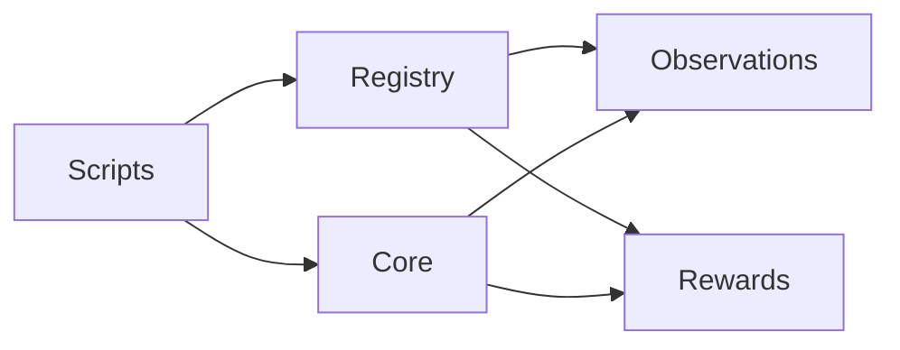
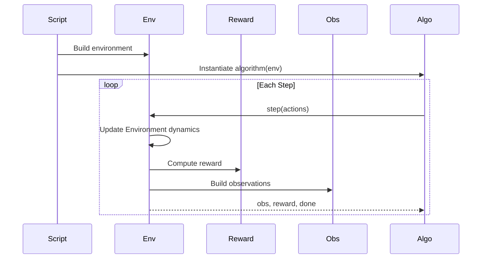

# 🐾 Multi-Agent Package

### The Environment Layer

This package implements the **predator–prey GridWorld environment**.

It defines:

* 🟥 Evironment dynamics (core dynamics)
* 🟧 Perception (observations)
* 🟨 Incentives (rewards)
* 🔌 Safe plug-in registry
* ▶ Experiment orchestration

It does **not** implement learning algorithms.

Learning lives in `baselines/`.

---

# 🧠 Conceptual Model

```text
Environment dynamics → Perception → Incentives → Learning
```

This package implements:

```
Environment dynamics → Perception → Incentives
```

Learning is external.

---

# 🏗 Structural Overview



### Dependency Direction

* Scripts construct the environment
* Registry selects plug-ins
* Core runs transitions
* Observations build agent views
* Rewards compute scalar signals

All dependencies flow **one direction only**.

---

# 🔁 Execution Flow



Algorithms see only:

```python
env.reset()
env.step(actions)
```

No internal state access.

---

# 📂 Directory Structure

```text
multi_agent_package/
│
├── core/                 🟥 IMMUTABLE Environment dynamics
│   ├── gridworld.py
│   ├── agent.py
│
├── observations/         🟧 PERCEPTION PLUG-INS
│   ├── base.py
│   ├── default.py
│   ├── local_only.py
│   ├── local_radius.py
│
├── rewards/              🟨 INCENTIVE PLUG-INS
│   ├── base.py
│   ├── base_reward.py
│   ├── predator_distance.py
│   ├── survival_reward.py
│
├── registry/             🔌 SAFE LOOKUP
│   ├── reward_registry.py
│   ├── observation_registry.py
│
├── scripts/              ▶ ENTRY POINTS
│   ├── run_from_config.py
│   ├── render.py
│   ├── evaluate.py
│   ├── sweep.py
```

---

# 🟥 Core (Environment dynamics Layer)

Defines:

* Grid construction
* Agent movement
* Collision handling
* Capture rules
* Episode termination
* Rendering
* Seeding

Core is stable infrastructure.

It should **not** be modified for experiments.

---

# 🟧 Observations (Perception Layer)

Define what agents can see.

Examples:

* `default` — full state
* `local_only` — self state only
* `local_radius` — partial observability

Observation builders must:

* Be deterministic
* Be pure
* Not modify environment state

They transform environment state → agent observations.

---

# 🟨 Rewards (Incentive Layer)

Define what agents optimize.

Examples:

* `base_reward` — capture-based
* `predator_distance` — shaping via distance
* `survival_reward` — time-based incentive

Reward functions must:

* Be pure
* Not modify environment state
* Return scalar values

They transform state → scalar signals.

---

# 🔌 Registry

Plug-ins are selected by name.

```python
get_observation_builder("local_radius")
get_reward_function("predator_distance")
```

This enables:

* YAML-driven experiments
* Safe modular swapping
* No manual wiring

---

# 🎛 Configuration-Driven Design

Experiments are defined in `configs/`.

Example:

```yaml
env:
  grid_size: 7
  seed: 42

observation:
  name: local_radius

reward:
  name: predator_distance
```

Changing experiments means changing YAML.

Not modifying core.

---

# 🔁 Determinism Guarantees

This package guarantees:

* Explicit state transitions
* Explicit reward computation
* Explicit observation construction
* Seed-controlled randomness

Identical configuration → identical trajectories.

---

# 🧩 Extension Rules

You may safely extend:

* Observation modules
* Reward modules
* Experiment configurations

You should not modify:

* Core Environment dynamics
* Capture semantics
* Transition mechanics

This separation enforces scientific control.

---

# 🎯 What This Package Enables

With this environment you can study:

* Emergent cooperation
* Coordination failure
* Partial observability effects
* Reward shaping impact
* Centralized vs decentralized learning
* Credit assignment dynamics

It is intentionally:

* Discrete
* Fully inspectable
* Mechanistically transparent

---

# 🧠 Design Philosophy

The goal is not realism.

The goal is:

* Clarity
* Modularity
* Reproducibility
* Research safety

This is a laboratory, not a game engine.

---

# ▶ Running the Environment

From repository root:

```bash
python -m multi_agent_package.scripts.run_from_config
```

Rendering controlled via:

```yaml
env:
  render_mode: human
```

---

# Final Summary

`multi_agent_package` is the deterministic environment layer of the Predator–Prey Gridworld system.

It implements:

* Environment dynamics
* Perception
* Incentives

Learning is intentionally external.

This separation is the core architectural principle.

---
